# KISS! Unit testing (JS/TS) - Function dependency injection


Keep it simple, stupid! Unit testing (JavaScript or TypeScript).
DevMastery inspirated pattern to do easy way unit testing! This setup needs only your JavaScript or TypeScript code and some testing framework (this example uses Jest). 

## example.js

**Basic pattern**

```javascript
const dependencies = {};

export const makeSimpleFunction = (injectedDependencies) => (prop) => {
  /* Function logic here */
};

const simpleFunction = makeSimpleFunction(dependencies);

export default simpleFunction;

```

### So let's go thru example.js

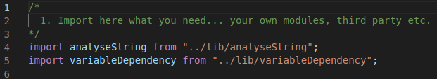

So basic thing, let's import or initialize anything what we want to start of the js/ts file.

***

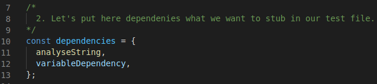

Then we add imports to dependencies const variable, so we can stub them when we do some unit testing.

***

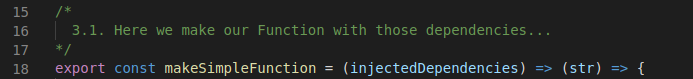

Notice the double arrow! So we have a function what is returning a function!
First function scope contains **a dependency injection**. Second contains basic properties (if needed). 

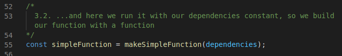

After 3.1 we make simpleFunction, calling makeSimpleFunction with dependencies const variable. So simpleFunction have now dependencies injected! 

***

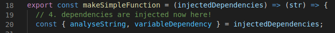

Now let's check inside our function wrapper. 
So injectedDependencies contains our dependencies and we can desctructure it to functionDependency and variableDependeny or what there ever is.

***

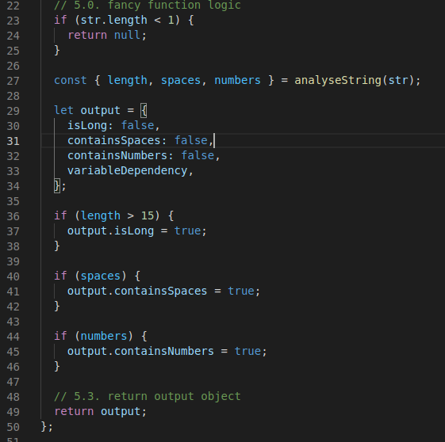

Now dependencies can be used how we want and we can write our fancy logic. 


***

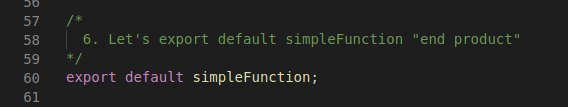

Export  default our simpleFunction. Now you can import this module and call simpleFunction('rock n roll'). 


***

### Let's check example.spec.js

**Basic pattern**

```javascript
import { makeSimpleFunction } from "./example";

const dependencies = {
  /* basic dependency stubs here */
};

let simpleFunction;
beforeEach(() => {
  simpleFunction = makeSimpleFunction(dependencies);
});

it('returns what it should', () => {
  const r = simpleFunction(...)
  expect(r).toBe(...)
})
```

***

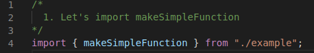

Import maker function, we wanna do testing simpleFunctions

***

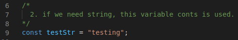

Testing const, if we have string anywhere then we can use this (like section 3.)

***

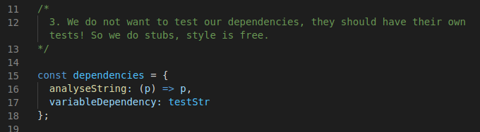

Here is our dependencies, these can be stubbed here. That variableDependency is string so lets put testStr there.

***

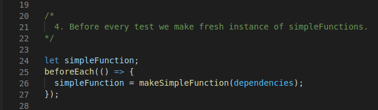

Lets do new fresh instance from simpleFunction start of every test

***

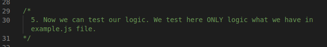

So here we can do our tests

***
